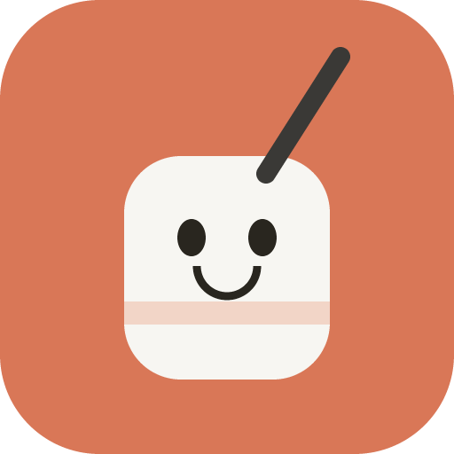
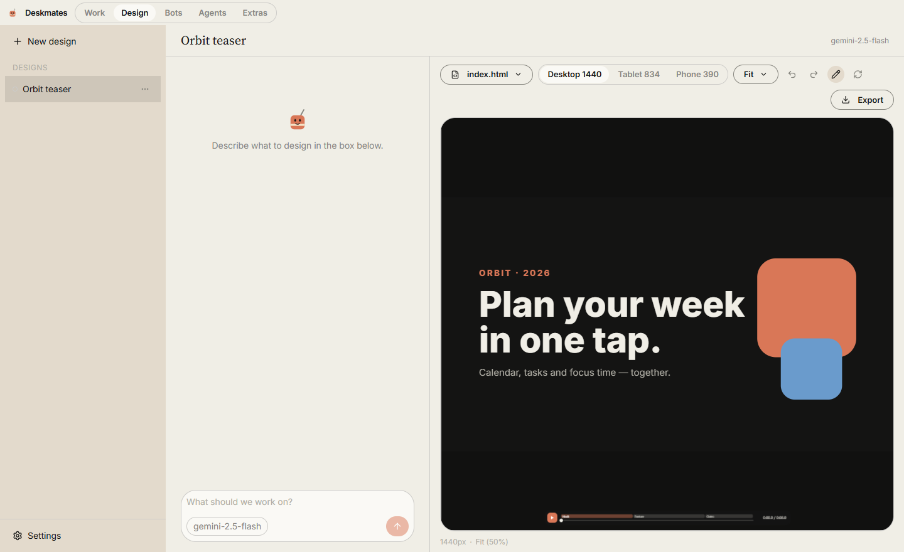
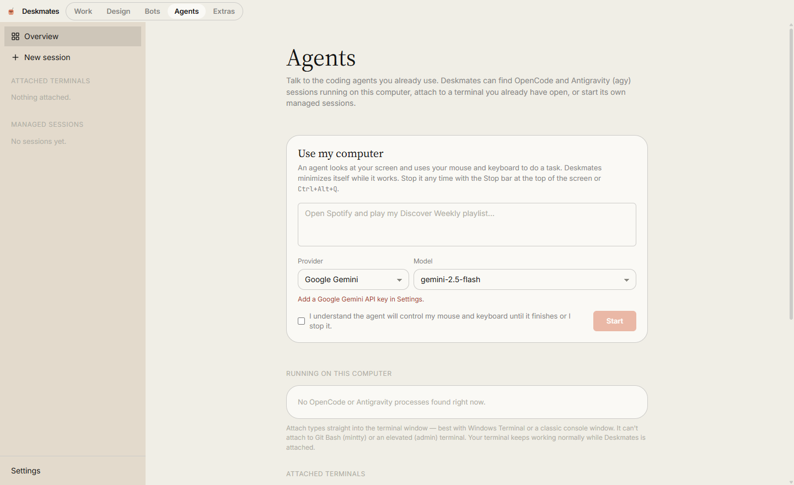

<div align="center">



# Deskmates

**Your AI coworkers for Windows.** An open-source desktop app where AI agents work in your folders, design and animate web pages you can edit like a slide, export motion graphics to MP4, run bots on their own Linux PC, drive your terminal coding agents, and even use your mouse and keyboard, all with your own API key.

[](LICENSE)


</div>



## Why Deskmates

- **Free and local.** No account and no subscription. You bring a key from Gemini, OpenAI, OpenRouter, NVIDIA, Groq, DeepSeek, Mistral, Together, xAI, or a local model through Ollama or LM Studio. Your files stay on your PC.
- **Several agents, one app.** A file-working assistant, a designer, scheduled bots, your OpenCode and Antigravity sessions, and computer control, each in its own tab.
- **You stay in charge.** Risky steps wait for your approval, every file change can be undone, and a Stop bar ends computer control at any time.

## What it does

### Work: an assistant in your folders
Pick a folder and describe the job. The agent plans, reads, writes and edits files, searches, runs commands (after you approve them), browses the web, delegates to sub-agents, and opens Word, Excel, PowerPoint and PDF files. Every change is snapshotted, so you can undo it from the chat. Each project keeps its own instructions (`DESKMATES.md` or `AGENTS.md`) and memory.

### Design: build pages, edit them like a slide, animate them
Describe a page and watch it appear in a live preview. Then edit it directly: click to select, drag to move, use the handles to resize, double-click to edit text, and change fonts, colors and spacing in the properties panel. Check it at desktop, tablet and phone widths. The agent can build reusable components, device frames, slide decks and documents, and it screenshots its own work to check it.

**Motion graphics and video.** The built-in `<motion-stage>` timeline engine turns a page into an animated piece. Scenes play back to back, elements animate from keyframes or ready-made presets (fade-up, pop, wipe, typewriter…), and the preview gets a timeline scrubber. Export any page to **MP4, WebM or GIF**. It is recorded frame by frame on a controlled clock, so every frame is exact. Pages also export to HTML, PDF and PNG.

### Bots: agents with their own PC
Each bot gets a small Linux PC (a container in WSL2) with a browser, its own logins and memory, and runs on a schedule. Watch its screen from the app and take over the mouse and keyboard at any time. The first template reads a site's new posts every day and sends you a WhatsApp summary.

### Agents: your terminal agents, plus computer use
- **Attach** to an OpenCode or Antigravity window you already have open and chat with it from Deskmates. When the agent asks for permission (reading a file, running a command), Deskmates shows the question with buttons and notifies you, so you never have to switch to the terminal.
- **Start sessions** that Deskmates manages for you, or use OpenCode and Antigravity as the model behind the Work and Design tabs.
- **Use my computer:** an agent looks at your screen and uses your mouse and keyboard to finish a task. Stop it at any time with the Stop bar or `Ctrl+Alt+Q`.



### Extras: skills, plugins and MCP
Import skills (the open `SKILL.md` format), install plugins from GitHub, and connect MCP servers. Every agent can use them, and you can even ask an agent to install a new MCP server or skill for you.

### And more
- **Phone access:** pair your phone's browser over your home Wi-Fi with a 6-digit code. It locks you out after repeated wrong codes.
- **Make it yours:** replace the logo, the idle and working animations, and the fonts.
- **Coding-agent guide:** connected terminal agents get a `DESKMATES-AGENTS.md` guide, a `deskmates` command and an MCP server, so they can work with your designs too.
- **Your own system prompts (optional):** drop a Markdown prompt per tab into [`prompts/`](prompts/README.md) and the agents follow it.

## Get started

Deskmates runs on Windows 10/11 (x64). Build it from source; installers will follow in [Releases](../../releases).

```bash
git clone https://github.com/LeutzuMarr/deskmates.git
cd deskmates
npm install
npm run dev
```

Then:

1. Open **Settings** and add an API key. Gemini's free tier is an easy start.
2. **Work tab:** add a project folder and describe a job. **Design tab:** describe a page.

**Optional requirements:**
- [FFmpeg](https://ffmpeg.org/) for video export (`winget install Gyan.FFmpeg`).
- WSL2 for bots. The app checks for it and walks you through setup.
- [OpenCode](https://opencode.ai) or Antigravity for the Agents tab.

To build the installer and a portable `.exe` yourself, run `npm run dist`. The build isn't code-signed, so Windows SmartScreen will warn about it: click **More info → Run anyway**.

## WhatsApp setup for bots

WhatsApp links one number to one device, so bots use a dedicated number, for example a second SIM or a spare phone:

1. Open the bot's page in the Bots tab and find the WhatsApp section.
2. Press **Take over**, then scan the QR code on the bot's screen with the spare phone.
3. Press **Give control back**. The bot can now send messages on that number by itself.

## Privacy

- **Local data:** everything (projects, chats, memory, undo snapshots, designs) lives in `%APPDATA%\Deskmates`, or in the folder set by `DESKMATES_DATA_DIR`.
- **API keys:** stored encrypted with Windows DPAPI. They are only ever sent to the provider they belong to, never logged, and never shown to the AI.
- **Free tiers:** some providers' free tiers (Gemini's, for example) may use your prompts to improve their products. Use a paid key if that matters to you.

## Development

Requires Node 24 or newer.

```bash
npm run dev          # run with hot reload
npm test             # unit tests (Vitest)
npm run typecheck    # type-check every project
npm run test:e2e     # build, then end-to-end tests (Playwright)
npm run dist         # Windows installer and portable .exe
```

```
src/
  main/       Electron main process: window, tray, keys (DPAPI), preview protocol, rendering and video export
  preload/    the window.deskmates API exposed to the UI
  core/       agents, tools, model providers, bots, terminals, connectors, store (plain Node, no Electron)
  renderer/   the React UI (Work, Design, Bots, Agents and Extras tabs)
  preview/    the Design tab's live-preview editor and component runtime
  bridge/     the deskmates command and MCP server for connected coding agents
  shared/     types shared across processes
bot-image/    the bots' Linux PC image
tests/        Vitest unit tests and Playwright end-to-end tests
```

Contributions are welcome: open an issue to discuss an idea, or send a pull request. Please run `npm test` and `npm run typecheck` first.

## License

Copyright © 2026 David Catrina (LeutzuMarr).

Deskmates is free software under the [GNU Affero General Public License v3.0](LICENSE) or any later version. You may use, study, share and change it. If you distribute a modified version, or run one as a service others use over a network, you must release its full source code under the same license.

The name "Deskmates" and its logo are not covered by this license. Forks and modified versions must use a different name and logo.

## Support Deskmates

Deskmates is free and built in spare time. If it saves you time, you can support its development with a donation:

**[☕ Donate via Revolut](https://revolut.me/leutzumarr)**
